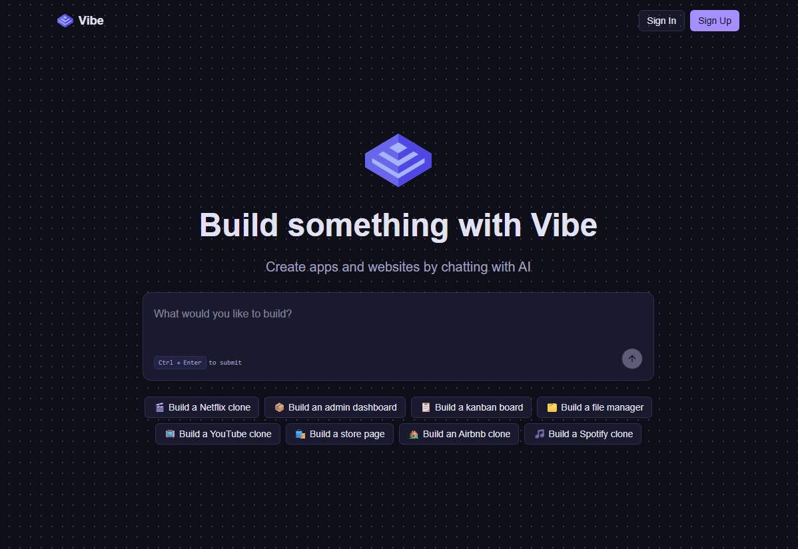
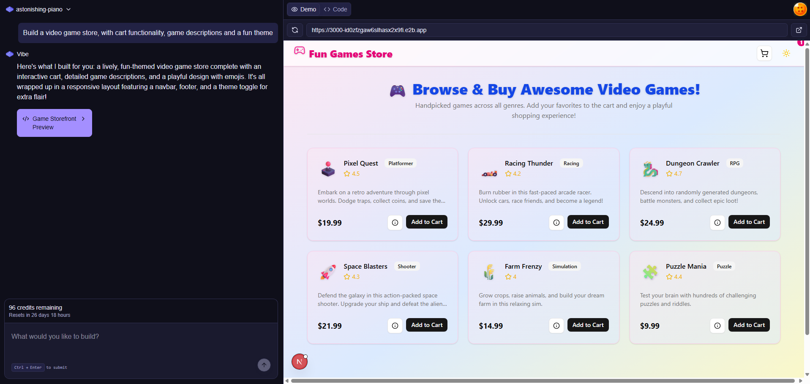
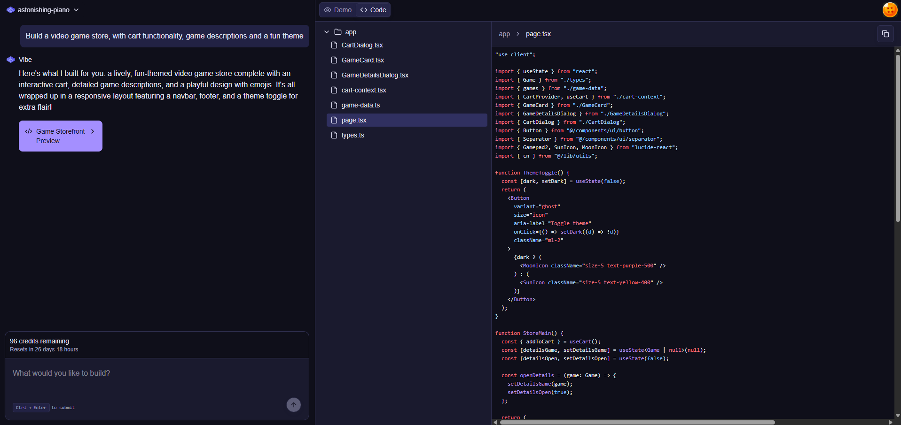

# Vibe ⚡️

**Vibe** is a full-stack AI-native platform that transforms natural language prompts into production-ready web applications. Built with **Next.js**, **Inngest**, and **E2B**, Vibe architecturally handles complex code generation in the background, delivering a complete `.tsx` codebase and file structure.

---

## 🚀 The Workflow

Vibe is an asynchronous engine designed for reliability:
1. **The Prompt:** Describe your vision (e.g., *"A crypto dashboard with dark mode and real-time charts"*).
2. **Background Processing:** **Inngest** triggers a reliable background workflow. No browser timeouts—the job runs until it's perfect.
3. **Sandboxed Generation:** Using **E2B sandboxes**, the AI generates a real file system, validates the code, and packages it in an isolated environment.
4. **Completion:** Secure notifications powered by **Clerk** alert you when your build is ready for download.

  
  

---

## 🛠 Tech Stack

- **Framework:** [Next.js](https://nextjs.org/) (App Router)
- **Authentication:** [Clerk](https://clerk.com/) (Secure login, signup, and user management)
- **Workflow Engine:** [Inngest](https://www.inngest.com/) (Reliable background jobs & queues)
- **Runtime Sandbox:** [E2B](https://e2b.dev/) (Isolated code interpretation and file system)
- **LLM:** [OpenAI API](https://openai.com/) (GPT-4o / o1 for architectural logic)
- **Billing:** Integrated subscription and credit-based system
- **Styling:** Tailwind CSS

---

## ✨ Key Features

- **Asynchronous UI:** Start a build, close the tab, and get notified when it's done.
- **Full File Structure:** Generates entire folders and component trees, not just snippets.
- **Secure Auth:** Enterprise-grade security via **Clerk**.
- **Usage-Based Billing:** Integrated billing system for managing generation credits.
- **Production-Ready Code:** Outputs clean, modular `.tsx` files.
- **Error Resilience:** Inngest retries ensure your build finishes even if an API flickers.

---
